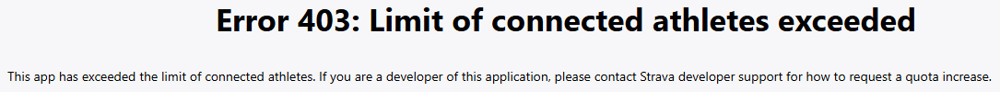

# Strava Yearly Summary Dashboard

A **Streamlit** application that generates an interactive yearly dashboard summarizing user activity data from Strava.

The app connects directly to the Strava API using **OAuth2**, downloads the user's activities, and presents key statistics and charts for a selected year.

---

## Motivation

Yearly summaries and advanced statistics in popular fitness platforms such as **Strava** and **Garmin** have gradually become **paid features**.

This project was created as a **personal alternative** — a way to generate a detailed yearly activity summary without relying on subscription-based analytics.

### Why Strava API?

Strava provides two ways to access personal activity data:
1. **Manual data export**
   - Requires submitting a data export request
   - The export is generated asynchronously (can take tens of minutes)
   - Data is delivered via email as a ZIP archive
   - Must be repeated manually each time

2. **Strava API (OAuth 2.0)** ✅
   - One-click authorization
   - Immediate access to activity data
   - No email communication required
   - Much more convenient for iterative analysis and experimentation

Despite the limitations imposed by the Strava API (such as connected athlete quotas), the API-based approach offers a **much better developer and user experience** compared to manual exports.

### Personal Motivation

Since official yearly summaries have become paid features, this app allows me to generate my **own custom yearly dashboards**.  
It is faster and more convenient than manually downloading data, waiting for emails, and unpacking ZIP files.

---

## Project Goal

The project aims to:
- Create a **personal, self-hosted yearly dashboard**
- Gain full control over **data processing and visualization**
- Avoid subscription fees for basic analytics
- Experiment with **real-world activity data analysis**

This application is **not a replacement** for Strava or Garmin, but a **custom, transparent, and extensible analytics tool** for personal use.

---

## Features

- OAuth2 authorization with Strava
- Year-based activity summary
- Overview metrics:
  - Total activities
  - Total distance, time, elevation gain
  - Favorite sport
- Training patterns:
  - Activities per weekday
  - Monthly distribution
  - Weekend vs weekday comparison
- Charts and visualizations:
  - Distance, time, elevation over time
  - Activity distribution histograms
- Sport and category-based filtering
- Logout and re-authorization at any time
- No database — data is fetched live from Strava

---

## Demo


---

## Strava API Limitations (403 Error)

This application uses the **Strava API** and follows the OAuth 2.0 authorization flow.

When another user attempts to authorize their Strava account, the following error may occur:



### Why does this happen?

Strava enforces strict limits on the number of athletes that can authorize a development application:
- **New / development applications** are limited to **1 connected athlete**
- Any additional authorization attempts result in a **403 error**
- This limitation is enforced **by Strava**, not by this application or Streamlit

As a result:
- The application works correctly for the first authorized user
- Subsequent users are blocked during the OAuth authorization step

### Is this a bug?

No. This is **expected behavior** for applications running under Strava’s default development quota.

### Personal Use (Important Note)

This limitation **does not affect personal use (using your own Strava API credentials)**:
- Running the app **locally**, or
- Deploying on **Streamlit Cloud** 

allows you to authorize **your own Strava account** without issues, since you are the only connected athlete.  

This setup is sufficient for:
- Personal dashboards
- Private analytics
- Experimentation and development

### How can this be resolved for multiple users?

**Request a quota increase from Strava and move to a production-grade architecture**
- Submit a request via Strava Developer Support
- Requires additional application details and justification
- Introduce a dedicated backend (e.g., FastAPI)
- Proper OAuth handling, token storage, and user management
- Recommended for multi-user deployments
  
---

## Current Status

This project is currently intended as:
- A **personal application**
- A **technical proof of concept**
- A **single-user dashboard**

Multi-user support is planned for a future version with a dedicated backend.

---

## Technologies

- Python 3.10+
- Streamlit
- Pandas
- Altair
- Strava REST API (OAuth 2.0)

---

## Running the App Locally

1. **Clone the repository**

```bash
git clone https://github.com/yourusername/strava_summary.git
cd strava_summary
```

2. Create and activate a virtual environment
```bash
python -m venv venv
source venv/bin/activate   # macOS / Linux
venv\Scripts\activate      # Windows
```

3. Install dependencies
```bash
pip install -r requirements.txt
```

4. Register your app on Strava
- Configure the authorization callback domain to match your localhost

5. Configure environment variables in .streamlit/secrets.toml:
```toml
STRAVA_CLIENT_ID=your_client_id
STRAVA_CLIENT_SECRET=your_client_secret
STRAVA_REDIRECT_URI=http://localhost:8080
```

6. Run the application
```bash
streamlit run app.py --server.port 8080
```

## Roadmap
- [ ] Separate backend (FastAPI)
- [ ] Multi-user support
- [ ] Persistent storage
- [ ] Improved caching

